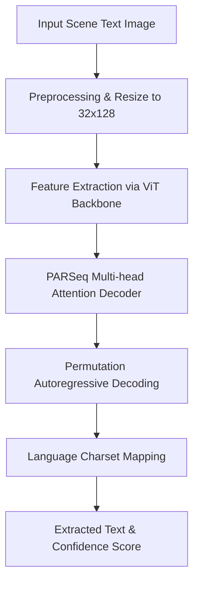

# 📖 Multilingual Scene Text Recognition System

[](https://www.python.org/)
[](https://pytorch.org/)
[](https://gradio.app/)
[](LICENSE)
[](https://huggingface.co/spaces/G-Madhuri/Multilingual_Scene_Text_Recognition_System)

A production-ready Scene Text Recognition (STR) system tailored for Indic scripts, specifically supporting **Telugu**, **Bengali**, and **Oriya**. Built on the state-of-the-art **PARSeq (Permutated Autoregressive Sequence)** architecture, this system enables high-accuracy text extraction from natural scenes (e.g., street signs, billboards, book covers).

🤖 **Live Demo**: Access the web application hosted on [Hugging Face Spaces](https://huggingface.co/spaces/G-Madhuri/Multilingual_Scene_Text_Recognition_System).

---

## 📌 Table of Contents
* [✨ Features](#-features)
* [⚙️ System Architecture](#%EF%B8%8F-system-architecture)
* [📊 Model Performance](#-model-performance)
* [📁 Datasets](#-datasets)
* [🗂️ Directory Structure](#%EF%B8%8F-directory-structure)
* [🚀 Getting Started](#-getting-started)
  * [Prerequisites](#prerequisites)
  * [Installation](#installation)
  * [Model Weights Setup](#model-weights-setup)
  * [Running the Web App](#running-the-web-app)
* [💡 How to Use the UI](#-how-to-use-the-ui)
* [🛡️ Troubleshooting](#%EF%B8%8F-troubleshooting)
* [🙏 Acknowledgments](#-acknowledgments)

---

## ✨ Features

* **Multi-lingual Script Support**: Highly accurate text recognition for Telugu, Bengali, and Oriya scripts.
* **State-of-the-Art Core**: Utilizes the PARSeq transformer architecture, optimizing both speed and recognition accuracy.
* **Gradio Web Interface**: A clean, modern dashboard built with customized CSS and a tabbed navigation system for each language.
* **Sample Galleries**: Integrated sample images for each language enabling users to perform one-click testing.
* **Confidence Scoring**: Real-time confidence statistics provided for every text prediction.
* **GPU Acceleration**: Built-in CUDA support for instantaneous local inference.

---

## ⚙️ System Architecture

The core recognition pipeline leverages the **PARSeq** architecture. PARSeq treats Scene Text Recognition as a sequence-to-sequence learning problem and improves over standard autoregressive models by using Permutation Language Modeling (PLM).



* **Feature Extractor**: A Vision Transformer (ViT) backbone is utilized to extract robust visual features from character sequences.
* **Autoregressive Decoder**: Predicts characters while leveraging bidirectional context dynamically during training, allowing it to perform well even with blurred, occluded, or stylized text.
* **Charset Customization**: Supports specialized language vocabulary maps, accommodating complex conjuncts and diacritics in Telugu, Bengali, and Oriya.

---

## 📊 Model Performance

Evaluated using standard text recognition metrics: **Exact Match (EM)** accuracy, **Character Error Rate (CER)**, and **Word Error Rate (WER)**.

| Language | Exact Match (EM) | CER (Character Error Rate) | WER (Word Error Rate) | Test Samples Count |
| :--- | :---: | :---: | :---: | :---: |
| **Telugu** | **69.7%** | **7.8%** | **30.3%** | 300 |
| **Bengali** | **55.4%** | **19.5%** | **44.6%** | 785 |
| **Oriya** | **52.0%** | **19.2%** | **48.0%** | 893 |

---

## 📁 Datasets

The models were pre-trained and fine-tuned on the benchmark Indic Scene Text datasets hosted by IIIT Hyderabad.

🔗 **Dataset Source**: [IIIT Hyderabad ILOCR Datasets](https://ilocr.iiit.ac.in/dataset/)

### 1. Pre-training: Synthetic Data
* **IIIT-Synthetic-IndicSTR-Telugu**: 1.5M train / 0.5M val / 0.5M test images
* **IIIT-Synthetic-IndicSTR-Bengali**: 1.5M train / 0.5M val / 0.5M test images
* **IIIT-Synthetic-IndicSTR-Oriya**: 1.5M train / 0.5M val / 0.5M test images

### 2. Fine-tuning: Real Scene Text Data
* **IndicSTR12-Telugu**: 900 train / 300 test images
* **IndicSTR12-Bengali**: 2,354 train / 785 test images
* **IndicSTR12-Oriya**: 2,676 train / 893 test images

---

## 🗂️ Directory Structure

```text
Multilingual_scene_text_recognition_system/
├── app.py                     # Gradio UI application & model inference setup
├── requirements.txt           # Python package dependencies
├── README.md                  # System documentation & setup guide
├── parseq/                    # Submodule directory for the PARSeq architecture
│   └── (PARSeq library modules cloned/unpacked during initialization)
├── telugu_samples/            # Real-world Telugu scene text sample images
├── bengali_samples/           # Real-world Bengali scene text sample images
└── oriya_samples/             # Real-world Oriya scene text sample images
```

---

## 🚀 Getting Started

Follow these steps to set up and run the system on your local machine.

### Prerequisites
* Python 3.8, 3.9, or 3.10
* pip (Python package installer)
* CUDA-capable GPU (Optional, but recommended for faster response times)

### Installation

1. **Clone the repository:**
   ```bash
   git clone https://github.com/YashaswiDarga/Multilingual_scene_text_recognition_system.git
   cd Multilingual_scene_text_recognition_system
   ```

2. **Create and activate a virtual environment (Recommended):**
   ```bash
   # Using venv (Windows)
   python -m venv venv
   .\venv\Scripts\activate

   # Using venv (Linux/macOS)
   python3 -m venv venv
   source venv/bin/activate
   ```

3. **Install dependencies:**
   ```bash
   pip install -r requirements.txt
   ```

### Model Weights Setup

Before starting the web application, you must download the trained PyTorch checkpoints for each language and place them directly in the **project root directory**:

| Language | Target Weight Filename |
| :--- | :--- |
| **Telugu** | `parseq_telugu_finetuned_final_5epochs.pth` |
| **Bengali** | `finetuned_bengali_model.pth` |
| **Oriya** | `parseq_oriya_final_direct.pth` |

### Running the Web App

Launch the Gradio interface using:
```bash
python app.py
```

Once initialized, navigate to `http://localhost:7860` in your web browser.

---

## 💡 How to Use the UI

1. **Choose a Language Tab**: Select the tab representing the language of your scene text image (Telugu, Bengali, or Oriya).
2. **Input Image**:
   * **Upload**: Drag & drop or click the main upload frame to select a local image.
   * **Gallery**: Click on any of the provided sample images under the preview frame to load it instantly.
3. **Execute OCR**: Click the **✨ Extract Text** button.
4. **View Outputs**: The recognized characters and average model confidence score will populate in the results cards on the right.

---

## 🛡️ Troubleshooting

### 1. `PARSeq not found at parseq/` or `ImportError: No module named 'strhub'`
Ensure that the PARSeq dependency is installed correctly via `requirements.txt`. The app automatically attempts to load and initialize imports, but if it fails, run:
```bash
pip install git+https://github.com/baudm/parseq.git
```

### 2. `FileNotFoundError: Model not found`
Double-check that the downloaded `.pth` weights are named exactly as shown in the [Model Weights Setup](#model-weights-setup) table and are saved in the project root folder.

### 3. CPU vs GPU Execution
By default, PyTorch will leverage CUDA if a compatible GPU and toolkit are detected. To force CPU execution or check availability, verify that `torch.cuda.is_available()` returns `True` in your python environment if you want GPU speed.

---

## 🙏 Acknowledgments

* **baudm/parseq**: For the robust open-source PARSeq model implementation.
* **IIIT Hyderabad (ILOCR)**: For providing high-quality Indic script datasets crucial for model pre-training and evaluation.
* **PyTorch Lightning & Hugging Face**: For supporting infrastructure and tools that make training and model distribution seamless.
